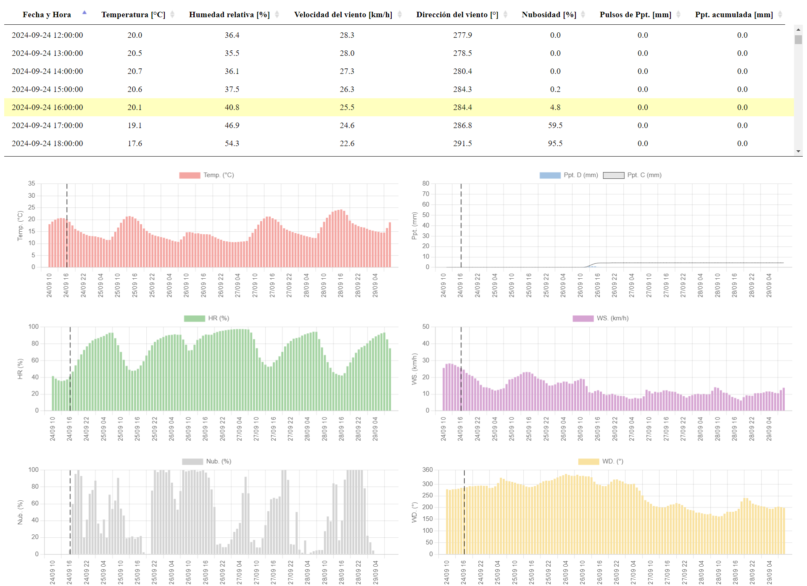

## GFS Tablero
 Tablero con el pronóstico de las variables climáticas que ofrece el Global Forecast System. La descarga de datos se realiza a través de la API de Python de Google Earth Engine y luego se sirven a través de Node.js.

 Las variables se pueden visualizar a través de una tabla o bien a través de un gráfico y corresponden a la Ciudad Autónoma de Buenos Aires.

 

   
 

 ### Requisitos
Es necesario contar con Python 3, Node.js y un usuario autenticado de GEE. Los pasos a seguir para logra la autenticación de GEE se pueden ver en este [artículo.](https://courses.spatialthoughts.com/install-gee-python-api.html#authentication)

Para reproducir el proyecto localmente, clonar el repositorio y ejecutar desde consola: *node server.js*